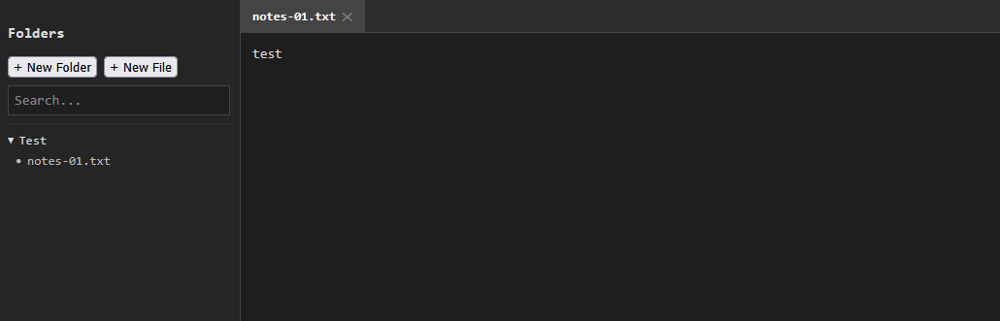

# cfo-scratchpad (Secure Local Note System)

Author: projectfong  
Copyright (c) 2025 Fong  
All Rights Reserved

---

## Summary

Lightweight, auditable, and self-hosted scratchpad designed for engineers, analysts, and operations teams who require a fast, file-based note system with a verifiable audit trail.  
The system provides tabbed editing, folder tree navigation, and client-side search — all operating entirely offline and without telemetry.  
Follows established cybersecurity frameworks and best practices (e.g., NIST SP 800-171 concepts) for secure local operation and log retention.

---

## Purpose

* Provide a reproducible, transparent environment for note-taking and operational tracking.  
* Eliminate vendor lock-in by using local `.txt` file storage.  
* Maintain an audit trail of all user actions (timestamped).  
* Enable compliance-aligned personal documentation in air-gapped or offline setups.  
* Distributed under the **MIT-NC-AUDIT-1.0** license (non-commercial research use).

---

## Core Components

| Component | Description | Notes |
|------------|--------------|-------|
| **Frontend (Static UI)** | HTML/CSS/JS-based editor interface with tabbed viewing and folder navigation. | Local-only, no network dependency. |
| **Backend (Go API)** | Serves static assets and file I/O operations. | Secure-by-default, read-only container. |
| **Scratchpad Data** | Mounted folder for `.txt` files. | Persists locally under `./scratchpad-data`. |
| **Audit Logs** | Records all user actions. | Stored in `/evidence/logs/`. |

---

## Folder and File Layout

```

.
├── backend/          # Go backend — API + static file server
├── frontend/         # Static HTML, CSS, JS
├── scratchpad-data/  # Local .txt data storage (mounted)
├── Dockerfile        # Multi-stage secure build
├── docker-compose.yml
└── Makefile          # Helper commands

```

All file operations and container lifecycle events are recorded with UTC ISO 8601 timestamps for traceability.

---

## Evidence Structure

Audit and operation evidence are retained under the local `evidence/` directory:

```

/evidence/
├── logs/YYYY-MM-DD/           # Daily JSON/text logs
└── hashes/                    # SHA256 or SHA512 integrity files

```

Each event includes:
```

timestamp, user, action, file, status, sha256_event_id

````

Retention expectations:
* Logs — minimum 180 days  
* Hashes — minimum 365 days  

No telemetry, analytics, or external data collection is performed.

---

## Installation and Operation

### Build

```bash
make build
````

### Run

```bash
make up
```

### Access

Open a browser to:

```
http://localhost:8888
```

Data persists locally in `./scratchpad-data`.

---

## Docker Manual Run (Alternative)

```bash
docker build -t cfo-scratchpad .
docker run -d \
  --name cfo-scratchpad \
  -p 8888:8888 \
  --read-only \
  --tmpfs /tmp \
  -v "$(pwd)/scratchpad-data:/scratchpad-data" \
  cfo-scratchpad
```

Stop and clean up:

```bash
docker stop cfo-scratchpad && docker rm cfo-scratchpad
```

---

## Installation with logs

Build
```
docker build -t cfo-scratchpad .
[+] Building 24.1s (23/23) FINISHED                                                                                                                                                      docker:default
 => [internal] load build definition from Dockerfile                                                                                                                                               0.1s
 => => transferring dockerfile: 4.13kB                                                                                                                                                             0.0s
 => [internal] load metadata for docker.io/library/alpine:latest                                                                                                                                   0.6s
 => [internal] load metadata for docker.io/library/golang:1.21                                                                                                                                     0.6s
 => [internal] load .dockerignore                                                                                                                                                                  0.0s
 => => transferring context: 2B                                                                                                                                                                    0.0s
 => [builder 1/6] FROM docker.io/library/golang:1.21@sha256:4746d26432a9117a5f58e95cb9f954ddf0de128e9d5816886514199316e4a2fb                                                                       0.0s
 => [stage-1  1/11] FROM docker.io/library/alpine:latest@sha256:4b7ce07002c69e8f3d704a9c5d6fd3053be500b7f1c69fc0d80990c2ad8dd412                                                                   0.0s
 => [internal] load build context                                                                                                                                                                  0.1s
 => => transferring context: 9.25kB                                                                                                                                                                0.0s
 => CACHED [builder 2/6] WORKDIR /app                                                                                                                                                              0.0s
 => [builder 3/6] COPY . .                                                                                                                                                                         0.3s
 => [builder 4/6] WORKDIR /app/backend                                                                                                                                                             0.4s
 => [builder 5/6] RUN printf "module cfo-scratchpad\n\ngo 1.21\n" > go.mod  && go mod tidy                                                                                                         1.8s
 => [builder 6/6] RUN date -u +"[INFO] %Y-%m-%dT%H:%M:%SZ Building static binary"  && GOOS=linux GOARCH=amd64 go build -trimpath -ldflags "-s -w" -o /cfo-scratchpad .                            18.9s
 => CACHED [stage-1  2/11] RUN apk add --no-cache su-exec dcron                                                                                                                                    0.0s
 => CACHED [stage-1  3/11] RUN adduser -D appuser                                                                                                                                                  0.0s
 => CACHED [stage-1  4/11] WORKDIR /home/appuser                                                                                                                                                   0.0s
 => CACHED [stage-1  5/11] COPY --from=builder /cfo-scratchpad .                                                                                                                                   0.0s
 => CACHED [stage-1  6/11] COPY --from=builder /app/frontend ./frontend                                                                                                                            0.0s
 => CACHED [stage-1  7/11] RUN cat <<'SH' > /usr/local/bin/entrypoint.sh                                                                                                                           0.0s
 => CACHED [stage-1  8/11] RUN chmod 0755 /usr/local/bin/entrypoint.sh                                                                                                                             0.0s
 => CACHED [stage-1  9/11] COPY rotate_logs.sh /usr/local/bin/rotate_logs.sh                                                                                                                       0.0s
 => CACHED [stage-1 10/11] RUN chmod 755 /usr/local/bin/rotate_logs.sh  && echo "0 0 * * * /usr/local/bin/rotate_logs.sh" > /etc/crontabs/root                                                     0.0s
 => CACHED [stage-1 11/11] RUN mkdir -p /evidence/logs && chown -R appuser:appuser /evidence                                                                                                       0.0s
 => exporting to image                                                                                                                                                                             0.1s
 => => exporting layers                                                                                                                                                                            0.0s
 => => writing image sha256:17605b9030dfc0e6d27228193dd1adaf8ceaaf2105bc45355f052a1ac880b7fb                                                                                                       0.0s
 => => naming to docker.io/library/cfo-scratchpad 
```

docker compose up -d
```
docker compose up -d
[+] Running 2/2
 ✔ Network cfo-scratchpad_default  Created                                                                                                                                                         0.1s
 ✔ Container cfo-scratchpad        Started  
```

Logs
```
docker logs -f cfo-scratchpad
[INFO]  2025-10-16T22:37:21Z Ownership set for /scratchpad-data (appuser:appuser)
[INFO]  2025-10-16T22:37:21Z Cron service started for daily log rotation
[INFO]  2025-10-16T22:37:21Z Starting backend as appuser
2025/10/16 22:37:21 [INFO] 2025-10-16T22:37:21Z Binding routes and starting server on port 8888
[INFO] 2025-10-16T22:38:28Z Listed 0 folders
[INFO] 2025-10-16T22:38:56Z Created folder: /scratchpad-data/Test
[INFO] 2025-10-16T22:38:56Z Listed 1 folders
[INFO] 2025-10-16T22:38:58Z Listed 0 files in folder: /scratchpad-data/Test
[INFO] 2025-10-16T22:39:26Z Listed 0 files in folder: /scratchpad-data/Test
[INFO] 2025-10-16T22:39:26Z Saved file: /scratchpad-data/Test/notes-01.txt
[INFO] 2025-10-16T22:39:26Z Before snapshot:
[INFO] 2025-10-16T22:39:26Z After snapshot:
[INFO] 2025-10-16T22:39:26Z Read file: /scratchpad-data/Test/notes-01.txt
[INFO] 2025-10-16T22:39:31Z Saved file: /scratchpad-data/Test/notes-01.txt
[INFO] 2025-10-16T22:39:31Z Before snapshot:
[INFO] 2025-10-16T22:39:31Z After snapshot: test
[INFO] 2025-10-16T22:39:41Z Listed 1 folders
```

Web UI Screenshot

---

## CLI and REST API

All endpoints served locally at `http://localhost:8888`.

| Method | Endpoint            | Purpose                       |
| ------ | ------------------- | ----------------------------- |
| GET    | `/folders`          | List all folder names         |
| GET    | `/files?folder=...` | List `.txt` files in a folder |
| GET    | `/file?path=...`    | Fetch file contents           |
| POST   | `/file/save`        | Save file updates             |
| POST   | `/file/move`        | Rename or move file           |
| DELETE | `/file?path=...`    | Delete a file                 |

Each API call is logged in `/evidence/logs/YYYY-MM-DD/`.

---

## Keyboard and User Interface

| Shortcut    | Action                  |
| ----------- | ----------------------- |
| Ctrl+S      | Save current tab        |
| Ctrl+Tab    | Switch between tabs     |
| Right-click | Rename or delete file   |
| Click “X”   | Close tab (retain file) |

New files are automatically suffixed (`-01`, `-02`) to prevent overwriting.

---

## Security and Isolation Notes

* Local-only API; no external endpoints.
* Container runs under a non-root UID.
* Read-only filesystem except mounted data volume.
* Evidence logs retained locally; no telemetry or analytics.
* Aligns with secure-by-default and log-everything policy.

---

## Known Limitations

* Maximum of 10 tabs open simultaneously.
* No authentication (requires perimeter firewall or proxy).
* Plaintext `.txt` format — apply encryption externally if needed.

---

## License

Distributed under **MIT-NC-AUDIT-1.0**  
Free for all use — but **never for sale**.  
Commercial redistribution or monetization is **strictly prohibited**.  

See [`LICENSE-MIT-NC-AUDIT-1.0.md`](./LICENSE-MIT-NC-AUDIT-1.0.md) for complete terms.

---

## Revision Control

| Version   | Date       | Summary                                                                                  | Author      |
| --------- | ---------- | ---------------------------------------------------------------------------------------- | ----------- |
| **1.0.0** | 2025-10-16 | Initial publication aligned with ProjectFong documentation and MIT-NC-AUDIT-1.0 license. | projectfong |
