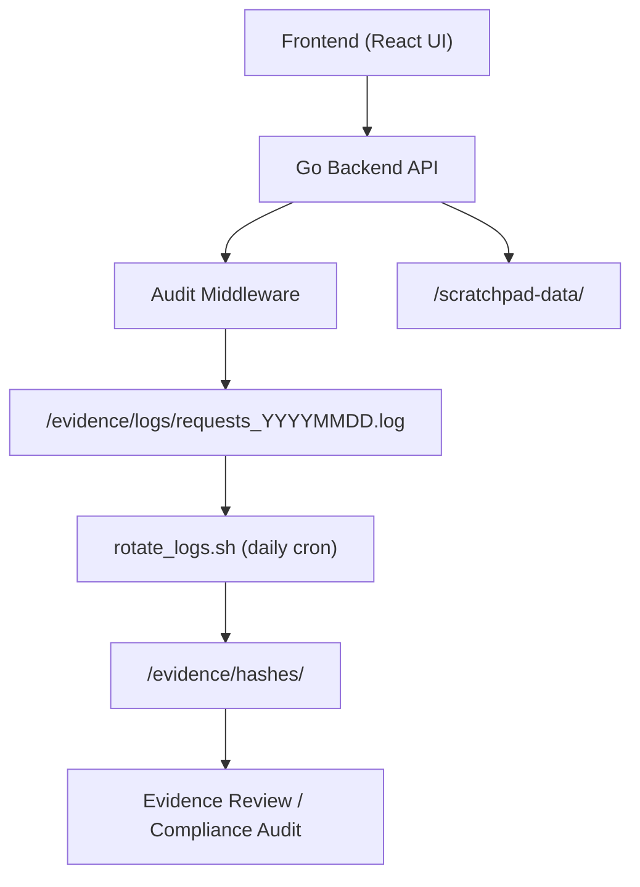

# architecture.md

Author: projectfong
Copyright (c) 2025 Fong
All Rights Reserved

---

## Summary

This document describes the architectural design of the **cfo-scratchpad** system.
It explains how the backend, frontend, and evidence components interact to deliver a secure, auditable environment for structured data entry, note management, and compliance-aligned research.
This file serves as the definitive technical reference for onboarding, security review, and reproducibility verification.

---

## Purpose

* Define how **cfo-scratchpad** operates internally and how its modules communicate.
* Document the data flow between frontend UI, backend API, and evidence logging.
* Establish an auditable trail for configuration and operational events.
* Maintain a reproducible architecture reference for future review and extension.

---

## System Overview

The **cfo-scratchpad** platform consists of five primary layers:

1. **Frontend (React + Static Assets)**

   * Provides the user interface for folder and file management.
   * Implements read/write operations via HTTPS calls to the Go backend.
   * Operates as a static site served directly by the backend binary under `/frontend`.

2. **Backend (Go API Service)**

   * Exposes REST endpoints for folder creation, file upload, and retrieval.
   * Implements middleware for request validation, audit logging, and UTC timestamping.
   * Serves the compiled frontend and handles all I/O through controlled, safe file paths.

3. **Audit and Evidence Layer**

   * Middleware writes timestamped JSON audit events under `/evidence/logs/requests_YYYYMMDD.log`.
   * Follows **MIT-NC-AUDIT-1.0** rules: no directory creation by backend, flat log structure, and 180-day retention.
   * A daily cron job compresses and hashes completed logs (`SHA512`) and maintains 365-day hash archives.

4. **Data Storage Layer**

   * `/scratchpad-data/` holds user files and folders managed by the backend.
   * `/evidence/logs/` retains operational audit logs for traceability.
   * `/evidence/hashes/` contains verification records produced by rotation scripts.

5. **Rotation and Maintenance Services**

   * A lightweight Alpine cron (`dcron`) runs `rotate_logs.sh` daily at 00:00 UTC.
   * The rotation script compresses prior-day logs, computes SHA512 hashes, and enforces retention windows.
   * All rotation activity is logged to `/evidence/logs/rotation.log`.

---

## High-Level Flow Diagram (Mermaid)

---

## Data Model Overview

| Entity               | Description                                   | Primary Fields                                                      |
| -------------------- | --------------------------------------------- | ------------------------------------------------------------------- |
| **folders**          | Logical directories created by user.          | `id`, `name`, `created_at`, `updated_at`                            |
| **files**            | Uploaded or generated text files.             | `id`, `folder_id`, `filename`, `hash`, `size`, `created_at`         |
| **audit_events**     | Request-level JSON records for each API call. | `timestamp`, `method`, `path`, `remote_ip`, `status`, `duration_ms` |
| **rotation_records** | Daily SHA512 verification of log bundles.     | `date`, `log_file`, `hash_path`, `archived_at`                      |

---

## Security and Isolation Considerations

* Runs as non-root user (`appuser`) inside an Alpine container.
* `/evidence` and `/scratchpad-data` declared as writable volumes; all other paths remain read-only.
* Backend creates files only within approved directories; path traversal is rejected.
* Audit log writes occur via controlled append-only mode.
* No outbound network connectivity except optional HTTPS updates.
* Cron jobs and backend actions emit UTC ISO-8601 timestamps for deterministic audit trails.
* Evidence retention and hash archives follow **MIT-NC-AUDIT-1.0** Section 2 requirements (180 days logs, 365 days hashes).

---

## Update and Extension Guidance

* Extend this file whenever new API endpoints, cron tasks, or evidence rules are added.
* Maintain diagram consistency when modules are refactored or renamed.
* Verify that new subsystems adhere to the same “no directory creation” and “non-root write” policies.
* Document any future integrations with external APIs under separate compliance review.

---

## Revision Control

| Version   | Date       | Summary                                                   | Author      |
| --------- | ---------- | --------------------------------------------------------- | ----------- |
| **1.0.0** | 2025-10-16 | Initial architectural documentation for `cfo-scratchpad`. | projectfong |
